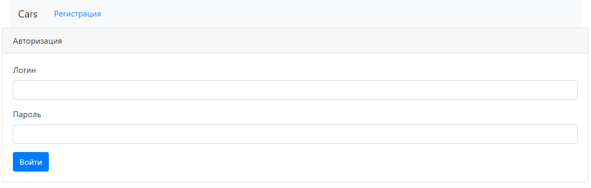
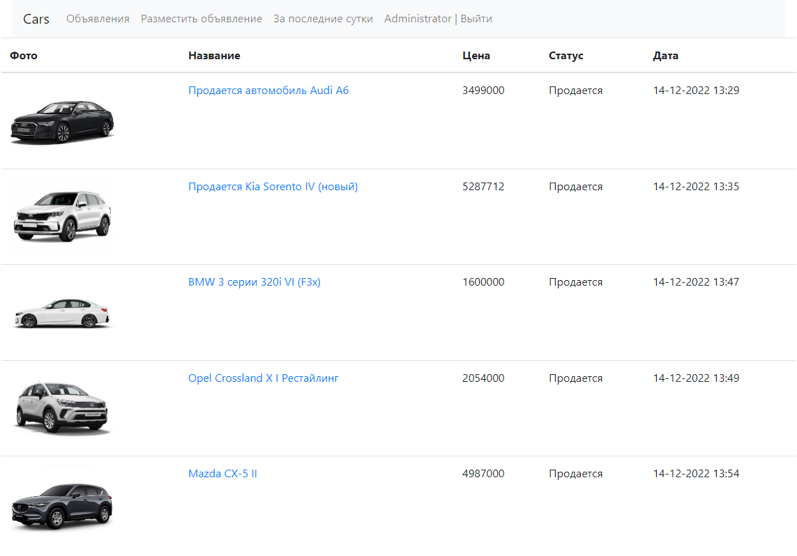
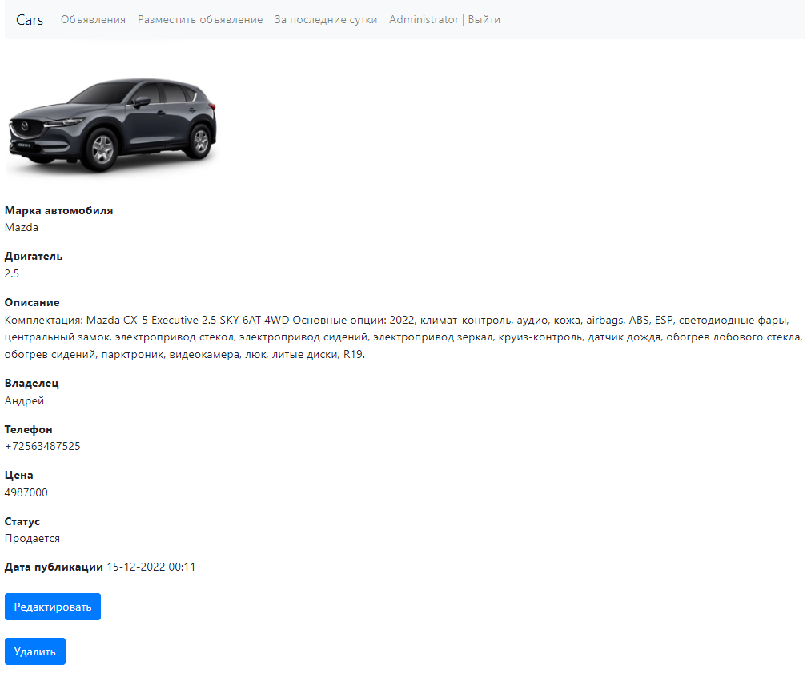
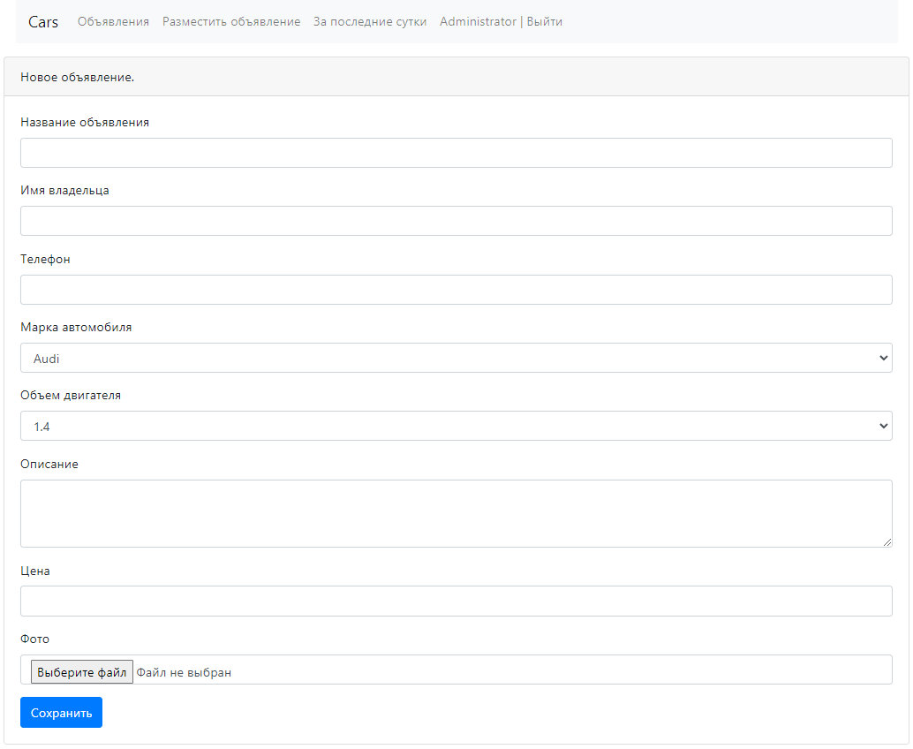

### job4j_cars

Проект выполнен в качестве тестового задания по теме Hibernate в рамках учебного курса Job4j.
Программа представляет собой площадку по продаже автомобилей. Пользоваель может просматривать все объявления,
а так же объяления за последние 24 часа. Имеется возможность редактирования и удаления собственных объявлений.
Объявления размещенные другими пользователями не имеют возможности редактирования.
При подаче объявления пользователь может выбрать марку и модель автомобиля из представленных списков,
добавить фото и описание автомобиля. Реализована возможность изменения статуса объявления в случае продажи автомобиля.

#### В проекте используются такие технологии как:

1. Spring boot 2.5.2
2. Hibernate 5.4.10
3. Thymeleaf 3.0.15
4. Bootstrap 4
5. JDBC
6. PostgreSQL 14
7. Java 17

#### Для сборки проекта понадобятся:
1. JDK 17
2. Maven 3.8.5
3. PostgreSQL 14

#### Запуск проекта:
1. Загрузите проект на свой компьютер.
2. В PostgreSQL создайте базу данных с названием cinema.
3. В корневой папке проекта выполните команду
```shell
mvn install
```
4. Для запуска проекта используйе команду
 ```shell
java -jar target/job4j_cars-1.0.jar
```
5. В браузере перейдите по ссылке http://localhost:8080/index
6. Для авторизации в режиме администратора используйте логин: Administrator, пароль: root

Страница авторизации



Главная страница форма с объявлениями.



При переходе по ссылке попадаем на траницу с подробным описанием объявления



Страница с формой добавления нового объявления



### Контакты для обратной связи:

mail: 101sergey101@gmail.com

telegram: [@bazarnov_sergey](https://t.me/bazarnov_sergey)


